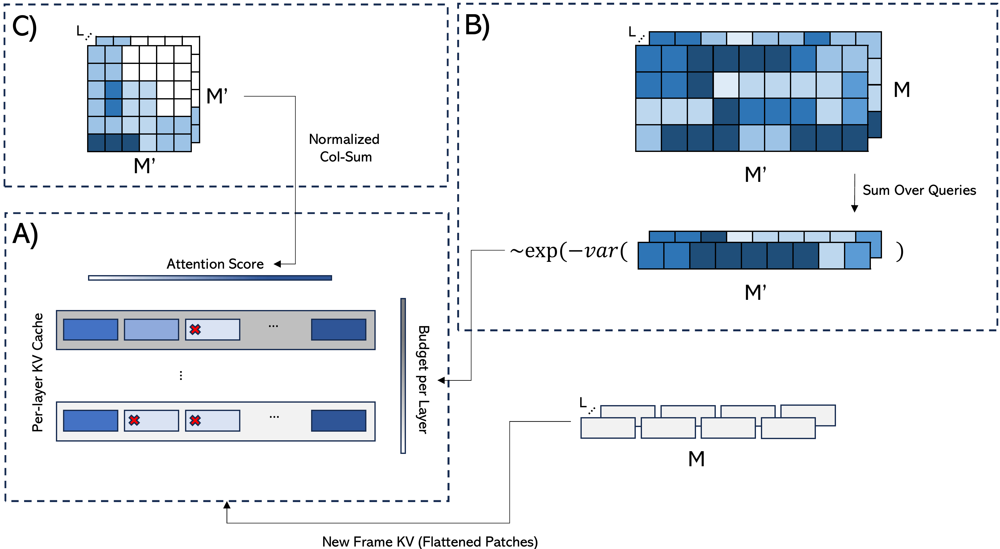

<div align="center">
<h1>Evict3R: Training-Free Token Eviction for Memory-Bounded Streaming Visual Geometry Transformers</h1>
</div>

### [Paper](https://arxiv.org/abs/2509.17650)  | [Project Page](https://soroush-mim.github.io/projects/evict3r/) 

>Evict3R: Training-Free Token Eviction for Memory-Bounded Streaming Visual Geometry Transformers


>[Soroush Mahdi](https://soroush-mim.github.io/), [Fardin Ayar](https://www.linkedin.com/in/fardin-ayar-279b44134/),  Ehsan Javanmardi, [Manabu Tsukada](https://tlab.hongo.wide.ad.jp/People/manabu-tsukada/), Mahdi Javanmardi


Our method, **evict3r**, manages the growing key–value (KV) cache of StreamVGGT by introducing a layer-wise token eviction framework.

## News

- **[2025/9/27]** code release.
- **[2025/9/22]** Paper released on [arXiv](https://arxiv.org/abs/2509.17650).


## Overview

Streaming visual transformers like StreamVGGT achieve strong 3D perception but suffer from unbounded growth of key–value (KV) memory,
which limits scalability. We propose a training-free, inference-time token eviction policy that bounds memory by
discarding redundant tokens while keeping the most informative ones. Our method uses significantly less memory with little to no drop in accuracy:
on 7-Scenes with long sequences it reduces peak memory from 18.63 GB to 9.39 GB while accuracy and completeness drop by only 0.003.
Under strict memory budgets, eviction enables denser frame sampling, which improves reconstruction accuracy compared to the baseline.
Experiments across video depth estimation (Sintel, KITTI), 3D reconstruction (7-Scenes, NRGBD), and camera pose estimation (Sintel, TUM-dynamics)
show that our approach closely matches StreamVGGT at a fraction of the memory and makes long-horizon streaming inference more practical.




### Installation

1. Clone StreamVGGT
```bash
git clone https://github.com/soroush-mim/evict3r.git
cd evict3r
```
2. Create conda environment
```bash
conda create -n evict3r python=3.11 cmake=3.14.0
conda activate evict3r 
```

3. Install requirements
```bash
pip install -r requirements.txt
conda install 'llvm-openmp<16'
```

### Download Checkpoints

Please download checkpoint of StreamVGGT from [Hugging Face](https://huggingface.co/lch01/StreamVGGT/) or [Tsinghua cloud](https://cloud.tsinghua.edu.cn/d/d6ad8f36fcd541bcb246/).


## Data Preparation


### Evaluation Datasets
Please refer to [MonST3R](https://github.com/Junyi42/monst3r/blob/main/data/evaluation_script.md) and [Spann3R](https://github.com/HengyiWang/spann3r/blob/main/docs/data_preprocess.md) to prepare Sintel, KITTI, 7scenes and Neural-RGBD datasets.

## Folder Structure
The overall folder structure should be organized as follows：
```
evict3r
├── ckpt/
|   ├── model.pt
|   └── checkpoints.pth
├── config/
|   ├── ...
├── data/
│   ├── eval/
|   |   ├── 7scenes
|   |   ├── bonn
|   |   ├── kitti
|   |   ├── neural_rgbd
|   |   ├── nyu-v2
|   |   ├── scannetv2
|   |   └── sintel
│   ├── train/
│   │   ├── processed_arkitscenes
|   |   ├── ...
└── src/
    ├── ...
```

## Evaluation
The evaluation code follows [MonST3R](https://github.com/Junyi42/monst3r/blob/main/data/evaluation_script.md), [CUT3R](https://github.com/CUT3R/CUT3R/blob/main/docs/eval.md), [VGGT](https://github.com/facebookresearch/vggt) and [StreamVGGT](https://github.com/wzzheng/StreamVGGT).

```bash
cd src/
```
### Monodepth
```bash
bash eval/monodepth/run.sh 
```

Results will be saved in `eval_results/monodepth/${data}_${model_name}/metric.json`.

### VideoDepth
```bash
bash eval/video_depth/run.sh 
```

Results will be saved in `eval_results/video_depth/${data}_${model_name}/result_scale.json`.

### Multi-view Reconstruction
```bash
bash eval/mv_recon/run.sh 
```

Results will be saved in `eval_results/mv_recon/${model_name}_${ckpt_name}/logs_all.txt`.


## Video Inference

The `inference_video.py` script allows you to run Evict3R on video files to generate 3D reconstructions and depth maps. The script automatically extracts frames from the input video, processes them through the StreamVGGT model with token eviction, and creates 3D visualizations.

### Basic Usage

```bash
python inference_video.py --video path/to/your/video.mp4
```

### Advanced Usage with Custom Parameters

```bash
# Run inference with custom frame sampling and visualization settings
python inference_video.py \
  --video path/to/your/video.mp4 \
  --out_dir custom_output_directory \
  --fps_interval 1.0 \
  --conf_thres 2.5 \
  --show_cam \
  --mask_black_bg \
  --eviction \
  --P 0.5 \
  --temp 0.5
```

### Extract Attention Maps (Optional)

To analyze the attention patterns during inference:

```bash
# Extract attention maps from specific layers (e.g., layers 0, 5, 11)
python inference_video.py \
  --video path/to/your/video.mp4 \
  --attn_layers "0,5,11" \
  --out_dir output_with_attention
```

### Parameters

- `--video`: Path to input video file (required)
- `--ckpt`: Path to StreamVGGT checkpoint (default: automatic download from HuggingFace)
- `--out_dir`: Output directory for results (default: "output_streamvggt")
- `--fps_interval`: Extract 1 frame every N seconds (default: 2.5)
- `--conf_thres`: Confidence threshold for 3D visualization (default: 3.0)
- `--show_cam`: Show camera poses in 3D visualization
- `--mask_black_bg`: Mask black background pixels
- `--mask_white_bg`: Mask white background pixels  
- `--mask_sky`: Apply sky segmentation mask
- `--attn_layers`: Comma-separated layer indices for attention visualization
- `--no_3d_viz`: Skip 3D GLB file generation
- `--device`: Computing device (default: "cuda")
- `--eviction`: use eviction
- `--P`: eviction budget
- `--temp`: tempratue for per layer budget allocation


### Example Workflows

**Quick 3D reconstruction from video: (eviction with budget=0.5 and temp=0.5)**
```bash
python inference_video.py --video demo.mp4 --fps_interval 0.5 --eviction --P 0.5 --temp 0.5
```

**High-quality reconstruction with camera visualization:**
```bash
python inference_video.py --video demo.mp4 --conf_thres 4.0 --show_cam --mask_black_bg
```

**Research analysis with attention maps:**
```bash
python inference_video.py --video demo.mp4 --attn_layers "0,3,6,9,11" --out_dir research_output
```


## Acknowledgements

## Acknowledgements
Our code is based on the following brilliant repositories:

[DUSt3R](https://github.com/naver/dust3r)
[MonST3R](https://github.com/Junyi42/monst3r.git)
[Spann3R](https://github.com/HengyiWang/spann3r.git)
[CUT3R](https://github.com/CUT3R/CUT3R)
[VGGT](https://github.com/facebookresearch/vggt)
[Point3R](https://github.com/YkiWu/Point3R)
[StreamVGGT](https://github.com/wzzheng/StreamVGGT)

Many thanks to these authors!

## Citation

If you find this project helpful, please consider citing the following paper:
```
@misc{mahdi2025evict3rtrainingfreetokeneviction,
      title={Evict3R: Training-Free Token Eviction for Memory-Bounded Streaming Visual Geometry Transformers}, 
      author={Soroush Mahdi and Fardin Ayar and Ehsan Javanmardi and Manabu Tsukada and Mahdi Javanmardi},
      year={2025},
      eprint={2509.17650},
      archivePrefix={arXiv},
      primaryClass={cs.CV},
      url={https://arxiv.org/abs/2509.17650}, 
}
```
